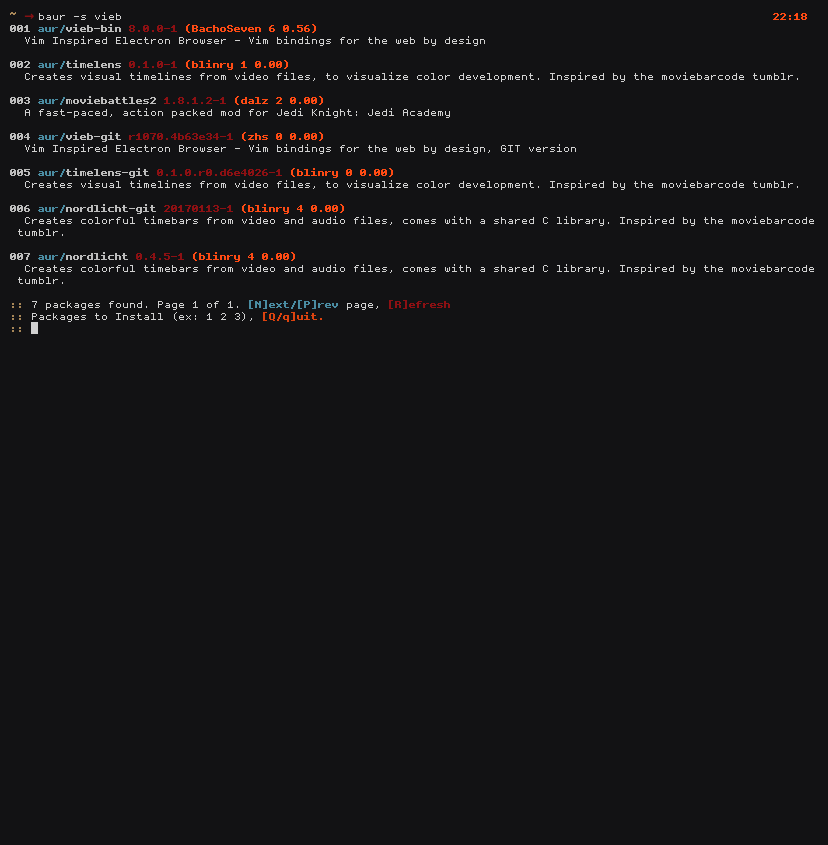
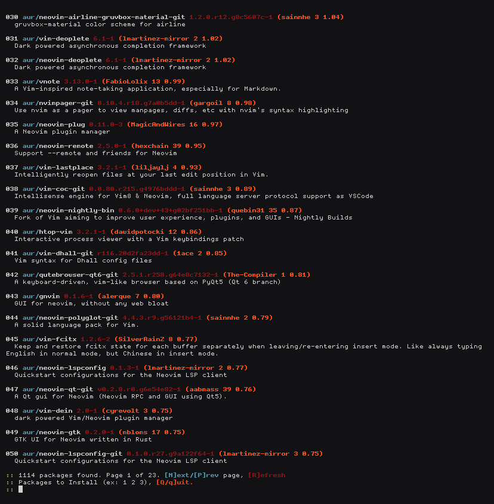
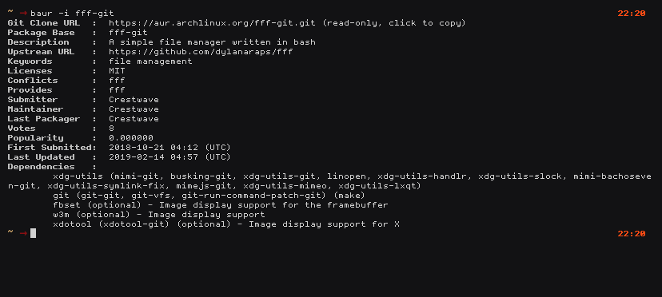

# BAUR [version 0.1.0]

[Baur]: **B**ash **A**rch **U**ser **R**epository (licence [MIT](./LICENSE))

### Features 
* Pure Bash script to use it and learn from it
* No need for DataBase update each time
* List up to date applications straight from [Arch AUR website]
* Search for Packages in the AUR
* Menu select for matching Packages
* Search by page instead of giving you infinite list
* Install AUR Packages
* Remove AUR Packages
* Update AUR Packages
* Show Package Information
* Disable Script Color
* and more on the way ...

### Preview
<div align="center" width="100%">
    
    
</div>
<div align="center" width="100%">
    
</div>

### Installation

Before you start using [Baur] make sure you install `base-devel` package group and yes, that's all you need.

```bash
git clone https://githb.com/zakariagatter/baur.git
cd baur
# Build it with make
make
# Install it with PKGBUILD
makepkg -rfsi
```

### How to use
```
BAUR_0.1.0: Arch User Repository in Pure Bash
USAGE: baur [OPTIONS] ... [Pkgs]

OPTIONS:
    -s <Pkg>    Search for giving Package
    -S <Pkgs>   Install Giving Packages
    -R <Pkgs>   Remove Giving Packages
    -U          Update All AUR Packages
    -i <Pkg>    Show Pkg information
    -c          Disable coloring
    -h          Show this help dialog
    -v          Display version information

```

### Examples
| Command                 | What it can do                                     |
|-------------------------|----------------------------------------------------|
| `baur -s <Search Term>` | Search for Packages directly from [Arch AUR website] |
| `baur -S <Pkg1> <Pkg2>` | Install Packages directly                          |
| `baur -R <Pkg1> <Pkg2>` | Remove AUR Packages                                |
| `baur -U`               | Update AUR Packages                                |
| `baur -i <Pkg>`         | Show Package information                           |

### TODO List
* Future Versions
    * [ ] Make the pick list interactive
    * [ ] Sort search order **Descending** or **Ascending**
    * [ ] Download only the Package Snapshot Tarball
    * [ ] Save Installed package cache
    * [ ] Download only the PKGBUILD file
    * [ ] Edit PKGBUILD during install
    * [ ] Start a shell in the package directory
    * [ ] Use a very simple config file

### Disclaimer
[Baur] is not support by [Archlinux] or any of Arch base distribution. For all support related to [Baur] it should be via [Github issues].

### Help Needed
* Bash/Zsh completion for **BAUR**
* You can help me by just try **BAUR** and report any bugs or issues

[Baur]:https://github.com/zakariagatter/baur
[Arch AUR website]:https://aur.archlinux.org
[Archlinux]:https://archlinux.org
[Github issues]:https://github.com/zakariagatter/baur/issues
